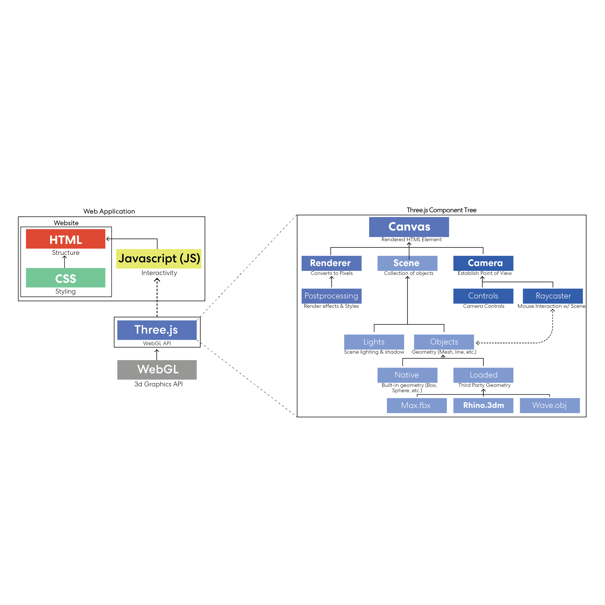
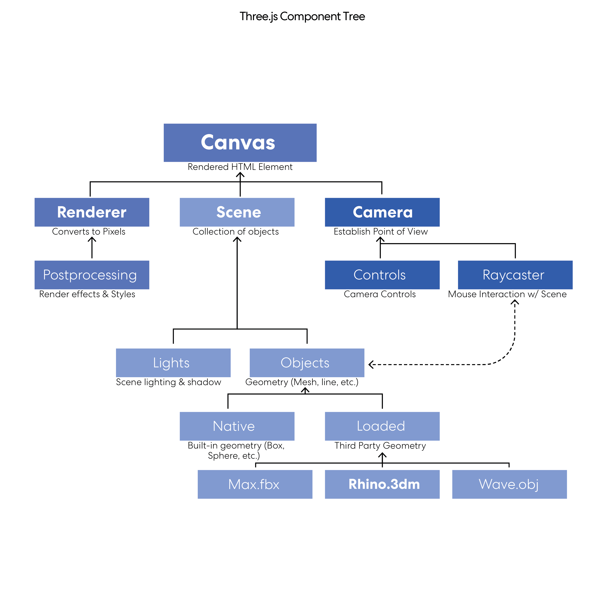
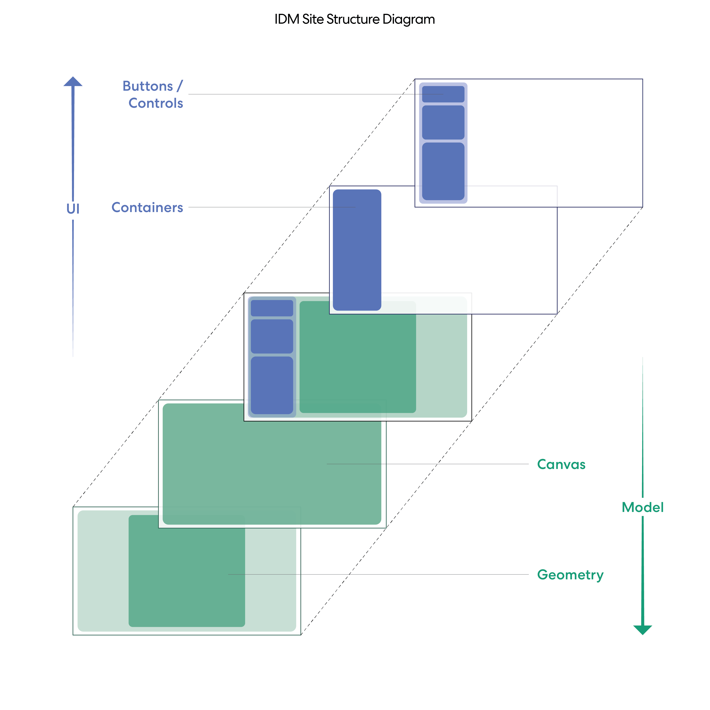

# Interactive Design Models w/ Three.JS 3️⃣


> This project is part of the 2024 Perkins&Will 'Innovation Incubator' research grant. The codebase is intended for public use, and while currently under heavy development, we welcome contributions once the research grant has concluded (~ Q4 2024). 

## Overview

Interactive Design Models (IDM) is a project started during the Spring 2024 Perkins&Will Innovation Incubator. The overall goal of this project is to research, test and implement a templeted codebase using Three.js which allows designers to load and interact with Rhino .3dm files in a lightweight stand-alone web application.

Research done to-date focuses around the 'building blocks' of the site, including loading a .3dm model, accessing the model data, and implementing a UI which is linked to the loaded models and data. Our aim was to develop these core elements so that users have a jumping off point to develop more unique applications that fit their project needs. 

Currently, we have worked to develop three different 'entry points' to the application by implementing Three.js alongside different popular Javascript frameworks. Each of these implementations can be found in companion repositories with their respective frameworks and these repositories are listed below. To-date, IDM-Vanilla and IDM-R3F are the most developed repos and should be the first point of reference. Our hope is to continue development of these repositories, and potentially develop new ones for other popular frameworks such as Vue and Svelte as possible.

> Code-bases and examples are currently held in unique repositories: <br/>
> [IDM-Vanilla (Three.js / Vanilla JS)](https://github.com/PW-SEA-CoDe/IDM-Vanilla) | [IDM-React (Three.js / React)](https://github.com/PW-SEA-CoDe/IDM-React) | [IDM-R3F (React / React-Three-Fiber)](https://github.com/PW-SEA-CoDe/IDM-R3F)

This ReadMe will be the primary resource for cataloguing our research to-date. Other more specific information related to each framework will be located in their respective respositories as needed.

### Contributors:

[William Franklin](https://github.com/wmfranklin20) | [Preston Pape](https://github.com/prxsto)

## 🌟 Opportunities & Purpose

### Project Scope & Purpose

#### <ins>What is Three.js?



[Three.js](https://threejs.org/) is a Javascript Application Programming Interface(API) which allows users to create 3D geometry in a web browser using [WebGL](https://www.khronos.org/webgl/). Three's high-level programming allows for users to more quickly create complex 3D scenes and objects and offers a wide range of features and flexibility.  Notably for this project, Three.js provides a range of 'out-of-the-box' model loaders for popular file types such as .gltf, .obj, and, most importantly for this project, .3dm. 

#### <ins>Why Three.js?

There are multiple libraries which, just like Three.js, reference down to WebGL, such as [Stack.gl](https://stack.gl/), [Deck.gl](https://deck.gl/), and [Bablyon.js](https://www.babylonjs.com/). Not only is Three.js the most popular of these WebGL libraries, but it also, in the opinion of the project team, provides the greatest flexibility & ease-of-use. Although libraries such as Deck.gl provide powerful large-scale data visulaization and analysis, the scope of this project is much smaller and focused around how we can load our specific design models used in every-day practice. For these reasons, Three.js appeared to be the best library to expand upon and understand.

#### <ins>Project Scope

Given the limited time granted as part of the Innovation Incubator process, in this early stage of the project the focus of the project centered around creating a minimal viable web application, which depended on understanding a few key elements including:

- Three.js Scene set-up (camera, lighting, scene)
- .3dm Model loading & data access (geometry, layers, materials)
- Construction of basic UI elements which interact with model & data (show/hide, light controls)

As mentioned in the overview, the project team also wanted to dedicate time to explore how Three.js can be integrated into different Javascript frameworks. As part of this early scope, the project focused around three different frameworks implementations:

- Three.js / Javascript (Plain) - The most basic implementation & using Three.js's default API
- Three.js / React - Basic Three.js but with React to control the UI
- [React-Three-Fiber(R3F)](https://r3f.docs.pmnd.rs/getting-started/introduction) / React - Utilizes a wrapping of Three.js into React components as R3F, with React UI.

Again, given the limited time, the project team developed the IDM-React framework only to the point of loading a .3dm file, and then focused efforts on the two other, and more clearly unique, frameworks in IDM-Vanille & IDM-R3F to better understand the two different implementations.


### Opportunities

#### <ins>What is possible?

IDM provides an exciting opportunity for designers to find new ways of communicating our design visions. Given the web's natural ability for interaction, multiple states and animation, vizualizing design models through this medium allows for opportunities that our standard, static presentation methods cannot achieve. 

The list of potential applications of this process are vast, but there are a few key ways that this methodology could be utilized to view our design ideas in new ways:

- Live, 3D view of models in context
- Toggle between design options
- Control sun angle/position to view shade implications in real-time
- Update model materials live
- Visualize building data associated to 3D geometry and space

#### <ins>Who is this project for?

Our hope is that IDM provides an entry point for any designer looking to utilize web technology in their design process. We understand however, that even our distillation of Three.js will require at least basic knowledge of web development and programming paradigms.

#### <ins>What's next from here?

Our goal is to continue to expand upon the work done during the Innovation Incubator, and grow the capabilities and resources available in this codebase. More and more opportunities to leverage this technology continue to appear in real projects, and our hope is that we can continue to merge that new knowledge into these repositories so that it continues to act as a 'living' template and resource both internally for Perkins&Will, but also externally for other designers who are curious to leverage the technology on their own projects.

Specific technical features which the project team would like to develop & implement in the future include:

- Loading saved views from Rhino file into accessible camera positions in Three
- More robust camera and lighting controls
- Building data, tied to 3D geometry and space & companion visualization graphics
- Different framework implementations including Vue and Svelte
- General style overhauls and guidelines
- QOL updates
- Back-end & server-side integrations

## 🛠️ API Guide

### Overview

#### <ins>API Documentation

Three.js's API is robust and covers a wide range of different components. The full documentation can be found here: [Three.js Documentation](https://threejs.org/docs/index.html#manual/en/introduction/Installation), but we will summarize the core elements that are critical for our project. 

### Key Components

In order to create a model and scene which can be interacted with, Three.js provides a layered structure of elements which much be called and connected in the application. Below is a rough diagram explaing the flow of these elements, staring at tertiary levels where functions are adding control or flexibility to secondary elements, which define key elements that are visualized, and which depend on a few core elements to be rendered in the browser. 



#### <ins>Core Elements

Three.js depends on three 'root' components which define the view of the model:

- Scene - The 3D scene in which the model lives
- Camera - The camera which creates a window through which to view the scene
- Renderer - The renderer which renders the camera's view of the scene.

Once these components are added to the project, the renderer then runs on a loop to produce snapshots of the scene. Note that each of these components has their own unique properties which can be updated as needed for your project. The IDM projects have created default values for these properties but refer to the Three.js Documentation for further information

#### <ins>Secondary Elements

Once the core elements have been added to the project, a second level of critical components are then needed

- Controls - Instructions for the camera to listen to the mouse, and keyboard for movement controls
- Lighting - Lights the scene and geometry (casting light for shadows)
- Geometry - Objects to be loaded into the scene
- Loaders - Allows for external 3d file types to be loaded into the scene

#### <ins>Tertiary Elements

- Materials - Assignable materials to control color, reflectivity, metalness, etc.
- Raycaster - Method which allows Three.js to track the mouse position over the scene and allows interaction with model components
- Helpers - Assistant components to visualize the locations of key components (lights, camera, etc.)
- Post-processing - Post-processing effects and styling

### Model Loading

Section about loading model

## 🖥️ Site Structure

### General Approach



At the highest level there are effectively two ways to interact with the model through the web application:

- <b>UI (HTML Elements)</b> - i.e. 'Click on this button to update the model/scene'
- <b>Model (Three.js Scene)</b> - i.e. 'Click on this model to update the UI'

These two 'layers' make up the root elements of the site in order to clearly locate and structure their respective function and components. Within each layer, we have tried to design a flexible structure through which users can quickly swap and test differnt UI components and model interaction as needed for their project.

``` html
<section id='ui'></section>      
<section id='scene'></section>
```
### UI Layer Structure

The 'UI' layer is intended to be used as the root parent for all HTML elements added to the application. You can imagine this layer as a mini-site containing all HTML components which sits above the 'Model' canvas. 

In general, the templates are designed so that the user can add 'containers' to the UI as needed. These containers act as the parent for unique sets of inputs, divs and any other HTML components desired. 

Below is an example of the expected structure for a simple UI, adding a sidebar and footer with corresponding components for each container.

``` html
Example UI Layer 

<section id='ui'>
        <div id='sidebar-container'>
                <div id='sb-foo-panel'></div>
                <div id='sb-bar-panel'>
                        <div id='sb-bar-title'>BAR</div>
                        <input id='sb-bar-input'></input>
                </div>
                <div id='sb-baz-panel'></div>
        </div>
        <div id='footer-container'>
                <div id='ft-foo-panel'></div>
                <div id='ft-bar-panel'></div>
        </div>
</section>
```
#### <ins>Dynamic UI Components

In order to structure the templates for flexibility, the codebase is designed to use React-style components to plug-and-play with different UI containers, components and styles. in IDM-Vanilla, these components are written as importable Javascript components, while in R3F, these are true React .jsx components. Each component has corresponding HTML and CSS variables which are returned to the main HTML file only when loaded, reducing the bloat in the initial HTML file.

Container components created in the IDM-Vanilla repository include:

- Sidebar (Current)
- Taskbar
- Floating Tab

Further information on how these components are called and added to the overall project structure are provided below in the 'Project Structure' chapter.

### Model Layer Structure

In terms of HTML rendering, the Model layer is primarly just the container which holds the Three.js scene. All means of interaction occur within the scene using Three.js components, specifically the Raycasting component. Further information about how the Raycaster operates can be found in the 'Project Structure' chapter below.

``` html
Example 'Model' Layer

<section id='scene'>
        <scene></scene>
</section>
```

## 📦 Project Structure

### General Approach

#### <ins>Modularization & Flexibility

Our goal in writing the codebases for this project was to allow maximum flexibility of the web applications where possible. To achieve this, we aimed to 'modularize' components as much as possible.  This approach provided some key benefits:

- Breaks down large, complicated, Three.js components into smaller files which can be more clearly annotated
- Allows components to be called as-needed, reducing application overhead and un-used elements
- Aligns components with Three.js component tree structure, to help uses intuit the development pipeline and expand their tree as needed


### Framework Specific Structures

Each framwork implemented in this project has its own folder and module structure approach. Please refer to the ReadMe in each companion repository for futher information on the respect structure of each project.

## 🦏 .3dm Model Loading & Data

### Overview
Three natively imports some model information directly from your Rhino .3dm file, however some key information is not imported, and other information is not easily accessible with the out-of-the-box import. This section will aim to explain the process of accessing Rhino model information and breakdown the scripts included in this project that assist with this effort.

### Native .3dm Information
The current functionality of Three allows users to load .3dm files with the following model information directly associated to a dictionary referenced as the model 'object'. 
```
Natively Imported Information
- Geometry
- Layer ID's
- Group ID's 
- Materials

Currently Unsupported Information
- Geometry associated to each Layer
- Geometry associated to each group
- Unique materials for each element (for interaction)
- Object center points
```

### Layers & Groups
### Materials
### Cameras
### Data
#### Model Data
#### Other Data

## 🗒️ Summary & Next Steps
